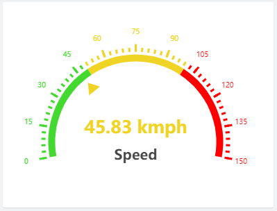

# Advanced Radial Gauge Widget for Cumulocity IoT

This widget shows the latest realtime measurement on a radial gauge.

### Installation - for the dashboards using Runtime Widget Loader
1. Download the latest `advanced-radial-gauge-{version}.zip` file from the Releases section.
2. Make sure you have Runtime Widget Loader installed on your Cockpit or App Builder app.
3. Open a dashboard.
4. Click `more...`.
5. Select `Install Widget` and follow the instructions.

### Deployment - as part of the Cumulocity IoT Cockpit application
1. Clone the repository on your local machine using `git clone https://github.com/SoftwareAG/cumulocity-advanced-radial-gauge-widget.git`.
2. Run `npm install` to install the module dependencies.
3. Run `c8ycli build` to build the cockpit application.
4. Run `c8ycli deploy` and follow the instructions to deploy the cockpit application on your tenant. This will include the widget also.

### Configuration - to view the KPI and trend Chart in the widget
1. Make sure you have successfully installed or deployed the widget.
2. Click on `Add widget`.
3. Choose `Advanced Radial Gauge` widget.
4. `Title` is the title of widget. Provide a relevant name. You may choose to hide this. Go to `Appearance` tab and choose `Hidden` under `Widget header style`.
5. Select the `device`.
6. `Measurement name` is the measurement supported by the selected device. Latest value of this measurement will be shown.
7. `Measurement font size` allows you to define the font size of the measurment value.
8. `No. of digits after decimal` allows you to define the digits you want to show after the decimal point in measurment value.
9. `Indicator type` allows you choose how you want to indicate the current value on the chart. It can be `Pointer` or `Progress Bar`.
10. `Axis width` is the width of axis.
11. `Axis label distance` is the distance of labels from the axis.
12. `Pointer offset (in %)` is the distance of pointer from the center of the chart. This is only applicable when `Indicator type` is `Pointer`.
13. `Progress bar color` is the color of progress bar. This is only application when `Indicator type` is `Progress bar`.
14. `Text` is Label Text. It's a free text field that can be used to name the measurement or radial guage.
15. `Font size` is Label font size. It allows you to set the Label font size.
15. `Hyperlink` allows you to provide a url where you would like to navigate on click of the label.
15. `Starting value` is the minimum measurment value expected.
16. `Limit value` is the maximum measurement value expected in case of single range. It will be limit value of a range in case of multiple ranges.
17. `Color` is range color. It allows you set the color of the defined range on axis.
18. `Add range` allows you define additional ranges. Make sure the limit value of a next range is higher than its previous one.
19. `Remove range` allows you delete a range.
20. Click `Save` to add the widget on the dashboard.
21. In case you see unexpected results on the widget, refer to browser console to see if there are error logs.

### Development - to do the enhancements and testing locally
1. Clone the repository on local machine using `git clone https://github.com/SoftwareAG/cumulocity-advanced-radial-gauge-widget.git`.
2. Run `npm install` to download the module dependencies.
3. Install c8ycli `npm install -g @c8y/cli` if not already.
4. Run `c8ycli server -u https://your_tenant_url` to start the server.
5. Go to `http://localhost:9000/apps/cockpit/` in the browser to view and test your changes.
6. (Optional) push the changes back to this repository.

### Build - to create a new build for the Runtime Widget Loader
1. Finish the development and testing on your local machine.
2. Run `gulp` to start the build process. Run `npm install -g gulp` to install gulp if not already.
3. Use `advanced-radial-gauge-{version}.zip` file in the `dist` folder as a distribution.

------------------------------

These tools are provided as-is and without warranty or support. They do not constitute part of the Software AG product suite. Users are free to use, fork and modify them, subject to the license agreement. While Software AG welcomes contributions, we cannot guarantee to include every contribution in the master project.

------------------------------

For more information you can Ask a Question in the [TECHcommunity Forums](http://tech.forums.softwareag.com/techjforum/forums/list.page?product=cumulocity).
  
  
You can find additional information in the [Software AG TECHcommunity](http://techcommunity.softwareag.com/home/-/product/name/cumulocity).